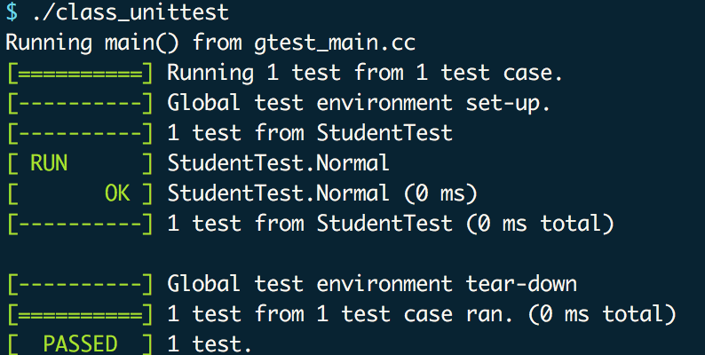

# 使用google test进行c++代码单元测试

## 编译执行源码进行查看
1. 执行`g++ class.cpp`
1. 执行`./a.out`可得：

```
小明的年龄是 15，成绩是 90（当前共1名学生）
小明的年龄是15
王康的年龄是 14，成绩是 60（当前共2名学生）
```


## 进行单元测试
1. 下载google test代码：`wget https://github.com/google/googletest/archive/release-1.7.0.zip`，解压缩该zip包
1. 修改`Makefile`中的`GTEST_DIR`为你的google test目录
1. 注释掉`class.cpp`中的`main`函数，因为测试文件本身有main，需要作为执行入口，若不注释，
最后还是会执行程序中的main函数
1. 执行`make`
1. 执行`./class_unittest`，可以得到结果如下：

<!--  -->

