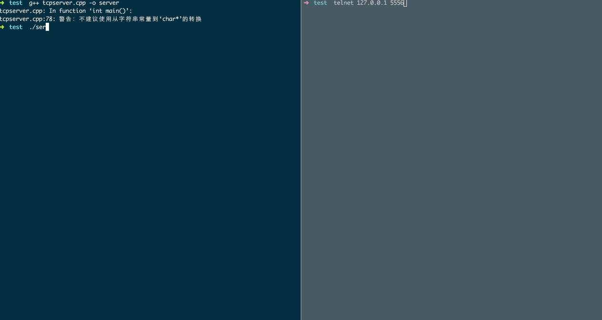

# C++ Socket编程示例

> 注：本示例代码需要在linux下编译运行

## 服务器
1. 执行`g++ tcpserver.cpp -o server`编译，`./server`运行
1. 重新打开一个窗口，执行`telnet 127.0.0.1 5556`，连接到刚刚建立的服务器
1. 输入hello world，可以看到服务器端有输出

示例：

## 客户端
1. 执行`g++ tcpclient.cpp -o client`编译，`./client`运行即可看到结果

## 参考链接
- [Linux C++ socket programming](http://codebase.eu/tutorial/linux-socket-programming-c/)
